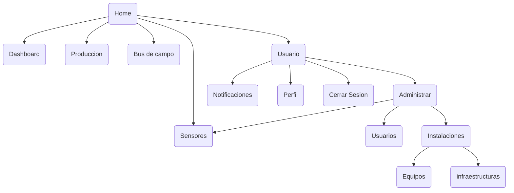
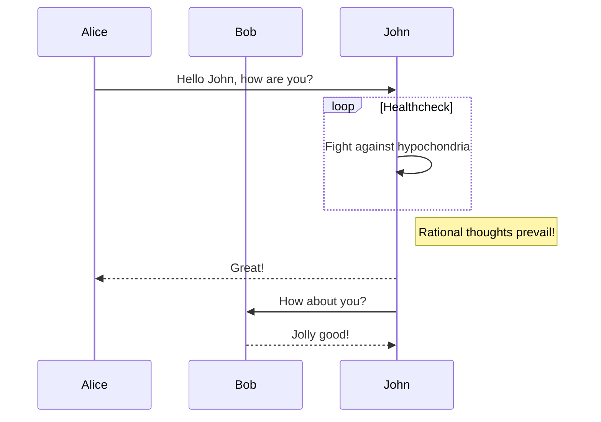

```mermaid
graph TD
    home(Home)-->dashboard(Dashboard)
    home(Home)-->sensores(Sensores)
    home(Home)-->produccion(Produccion)
    home(Home)-->busdecampo(Bus de campo)
    home(Home)-->usuario(Usuario)
    
    usuario-->administrar(Administrar)
    administrar--> usuarios(Usuarios)
    administrar--> sensores(Sensores)
    administrar--> instalaciones(Instalaciones);
    
    instalaciones--> equipos(Equipos)
    instalaciones--> infraestructuras(infraestructuras)
    
    

    usuario-->notificaciones(Notificaciones)
    usuario-->perfil(Perfil)
    usuario-->logout(Cerrar Sesion)
   
```

```mermaid
sequenceDiagram
    participant Alice
    participant Bob
    Alice->>John: Hello John, how are you?
    loop Healthcheck
        John->>John: Fight against hypochondria
    end
    Note right of John: Rational thoughts prevail!
    John-->>Alice: Great!
    John->>Bob: How about you?
    Bob-->>John: Jolly good!
```

